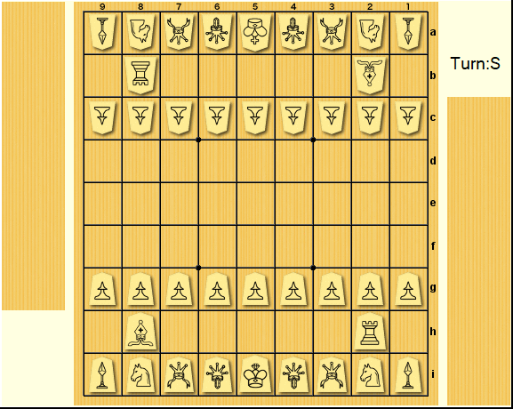

## Обработка данных для моделирования уровня подготовки игроков сёги
##### Предметная область
Сёги – игра шахматного типа в которой игроки, так же как в классических шахматах, по очереди совершают ходы, перемещая фигуры на доске. Отличие заключается в некоторых новых фигурах и возможности после захвата фигуры противника сбросить ее в любое место на доске как свою.

Как и в шахматах для определения силы или рейтинга игрока используется модификация рейтинговой системы [Эло](https://ru.wikipedia.org/wiki/%D0%A0%D0%B5%D0%B9%D1%82%D0%B8%D0%BD%D0%B3_%D0%AD%D0%BB%D0%BE). Т.е. учитывается только результат партии (выигрыш/проигрыш) и в соответствии с ним прибавляется и вычитается некоторое количество баллов, зависящее от разницы текущих рейтингов двух сражавшихся игроков. Производимые внутри партии ходы практически не рассматриваются. Впрочем, [на одном сайте онлайн-сёги](https://system.81dojo.com/en/players/show/cranco) определяется игровой стиль по таким параметрам как: построение замка, размен слонов и положение ладьи. Всё это относится к действиям во время опенинга (начало партии).
Хотелось бы сделать что-нибудь посущественнее…

##### Данные. В каком виде, сколько
Позицию фигур на доске и в руке (захваченные фигуры, которые можно сбросить на доску) и ход можно однозначно записать. Запись партии в сёги называется кифу.
Было собрано более 50000 кифу (датамайнинг [с сайта](https://system.81dojo.com/))). Запись партии – файл расширения kif (специального расширения сайта 81dojo), в котором содержится информация об игроках и типе игры, последовательные однозначно интерпретируемые ходы и затраченное на них время. В среднем в партии 120 ходов.

##### KIF -> (USI) -> движок -> число
Чтобы дать количественную оценку выгодности хода, можно реализовать различные методы (минмакс свертки, альфа отсечения и проч). Но так как в свободном доступе существуют движки – компьютерные программы, играющие значительно сильнее человека (которые должны оценивать позиции, чтобы делать хорошие ходы), было решено использовать их для получения количественной оценки выгодности хода.
 
[USI (Universal Shogi Interface)](http://hgm.nubati.net/usi.html) основанный на Universal Chess Interface позволяет взаимодействовать с движками посредством унифицированных команд. Задав начальную позицию, можно запустить из нее поиск лучшего хода.
***
#### Необходимо для работы программы (которой еще нет):
#### БД
Текущую версию БД можно взять [здесь](https://disk.yandex.ru/d/AG3rjBfZ7EIQCQ).
#### Движок
Для работы программе необходим движок сёги (*.exe). Скачайте ~~любой движок, поддерживающий USI~~ [YaneuraOU](https://mk-takizawa.github.io/elmo/howtouse_elmo.html) и разместите его в папке с программой data_processing.py.
#### Windows